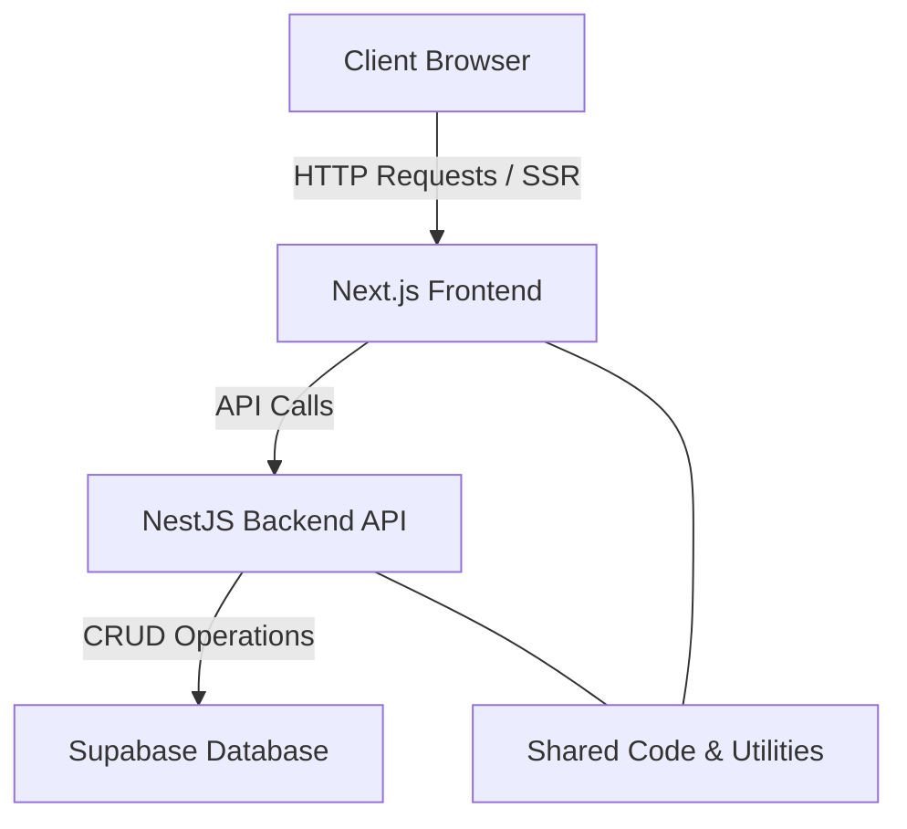

# along-puppyspa
Below is your markdown file content. You can copy and paste the text into a file named puppy-spa-system-design.md to download it locally.

⸻


# System Design Document – Puppy Spa Waiting List Management App

## 1. Overview

**Objective:**  
Digitize Puppy Spa’s paper-based logbook process by providing a web application that allows the receptionist to:
- Record new entries (owner/puppy details, service, arrival time)
- Create and manage daily waiting lists
- Reorder the waiting list dynamically
- Mark clients as serviced
- Search historical logs to review service records

**Scope:**  
- **Frontend:** A **Next.js** application offering a responsive, SEO-friendly interface.
- **Backend:** A **NestJS** API delivering robust business logic and data management.
- **Shared Code:** A centralized package for common utilities, interfaces, and types.
- **Deployment:** Both applications are deployed on Vercel as separate projects derived from the same monorepo.

---

## 2. Monorepo Architecture & File Structure

The solution is maintained in a monorepo that centralizes dependency management and facilitates code sharing. The directory structure is as follows:

```
puppy-spa/
├── apps/
│   ├── frontend/      # Next.js application (FE)
│   │   ├── pages/
│   │   ├── components/
│   │   ├── public/
│   │   ├── styles/
│   │   └── package.json
│   └── backend/       # NestJS application (BE)
│       ├── src/
│       │   ├── modules/
│       │   ├── controllers/
│       │   ├── services/
│       │   └── main.ts
│       └── package.json
├── packages/
│   └── shared/        # Shared code for FE and BE
│       ├── src/
│       │   ├── types.ts
│       │   └── utilities.ts
│       └── package.json
├── tools/             # Scripts, deployment helpers, etc.
├── .gitignore
├── package.json       # Root package manifest (dependency management)
├── nx.json            # Nx configuration for the monorepo (if using Nx)
└── README.md
```

**Highlights:**
- **`apps/`:** Holds separate applications.
  - **`frontend/`:** Contains the Next.js codebase.
  - **`backend/`:** Contains the NestJS codebase.
- **`packages/shared/`:** Provides shared utilities and interfaces for consistent code usage across the stack.
- **Centralized Management:** Root-level configuration files and scripts simplify dependency management, linting, and CI/CD processes.

---

## 3. Architectural Overview & Live Deployment

### Live Architecture Diagram



**Diagram Explanation:**
- **Client Browser:** End-users access the live application via their web browsers.
- **Next.js Frontend:** Hosted on Vercel (project rooted in `apps/frontend`), this part leverages server-side rendering and file-based routing for an efficient, SEO-friendly experience.
- **NestJS Backend API:** Deployed on Vercel as a serverless function (project rooted in `apps/backend`), it handles all RESTful API requests and business logic.
- **Supabase Database:** Manages persistent storage for waiting lists and historical records.
- **Shared Code:** Both frontend and backend reference common types and utilities from the shared library, ensuring consistency and reducing duplication.

---

## 4. Deployment on Vercel

### Frontend Deployment (Next.js)

- **Configuration:**
  - The Vercel project is linked to the monorepo with the root directory set to `apps/frontend`.
  - Build settings use the default Next.js build command (`next build`), allowing for automatic server-side rendering and static asset generation.
- **Status:**
  - The frontend is live and updated automatically with every code push, ensuring smooth deployment and high performance.

### Backend Deployment (NestJS)

- **Configuration:**
  - A separate Vercel project is configured with the root directory set to `apps/backend`.
  - The NestJS backend is packaged as a serverless function. This is achieved either via a custom adapter or using a tool such as [vercel-nestjs](https://github.com/znck/vercel-nestjs).
  - A `vercel.json` file in the `apps/backend` directory specifies routing, for example:

    ```json
    {
      "version": 2,
      "builds": [
        {
          "src": "dist/main.js",
          "use": "@vercel/node",
          "config": { "maxLambdaSize": "50mb" }
        }
      ],
      "routes": [
        {
          "src": "/api/(.*)",
          "dest": "dist/main.js"
        }
      ]
    }
    ```
- **Status:**
  - The backend is live, effectively handling all API requests and connecting to the managed Supabase database for CRUD operations.

---

## 5. Future Considerations

As the Puppy Spa Waiting List Management App evolves, several enhancements could be implemented to further improve functionality and scalability:

- **Multi-Worker Support:**
  - *Concurrent Waiting Lists:*  
    Support for multiple spa workers operating concurrently, each with their own waiting list. This would allow the application to manage parallel service queues if multiple workers handle different areas of the spa.
  - *Role-Based Access:*  
    Implementation of user roles and permissions to manage multiple users (e.g., receptionists, spa managers) with varying levels of access and control over individual waiting lists.

- **Enhanced CI/CD Pipeline & Testing:**
  - *Automated Testing:*  
    Expand the testing suite to include comprehensive unit, integration, and end-to-end tests. This ensures robust test coverage and maintains code quality with every update.
  - *Pipeline Automation:*  
    Implement a CI/CD pipeline with automated linting, testing, and deployments. Tools such as GitHub Actions, CircleCI, or Vercel’s built-in integrations can support continuous delivery.
  - *Code Coverage Metrics:*  
    Integrate metrics and dashboards to monitor test coverage and performance of deployed builds.

- **Real-Time Functionality & Notifications:**
  - *Live Updates:*  
    Enable real-time updates of waiting lists using WebSockets or server-sent events. This would allow receptionists to see immediate changes when clients leave or when lists are reordered.
  - *Notifications:*  
    Implement notifications (e.g., via email or SMS) to alert spa workers of important events, such as a new client check-in or changes in waiting order.

- **Advanced Reporting & Analytics:**
  - *Historical Data Analysis:*  
    Develop dashboards and reporting tools to analyze service metrics such as average waiting time, service completion rates, and daily traffic trends.
  - *Search Improvements:*  
    Enhance the search functionality with advanced filtering and partial matching capabilities to quickly retrieve historical records or identify repeat clients.

- **Scalability & Infrastructure Enhancements:**
  - *Microservices Transition:*  
    Consider transitioning to a microservices architecture if the application grows significantly, allowing independent scaling and deployment of different components.
  - *Enhanced Logging and Monitoring:*  
    Integrate logging and monitoring solutions (such as Datadog or Grafana) for improved observability and rapid troubleshooting.
